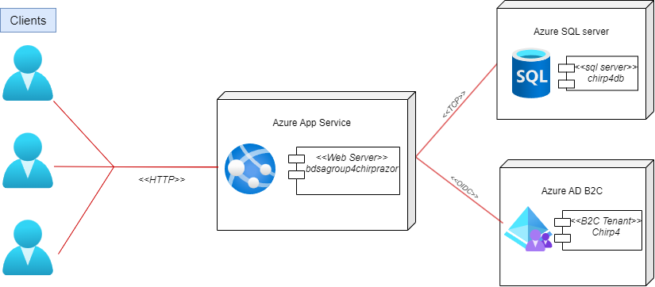

## Architecture of deployed application
In the following figure a deployment diagram can be seen of our Chirp application and their different nodes.

Chirp is a client-server application hosted on the Azure wbe app service. The web app is connected to a Azure SQL server where it's database can be found. Furthermore the application makes use of the Azure AD B2C for authentication request. The different nodes means of communication is represented in the diagram.
