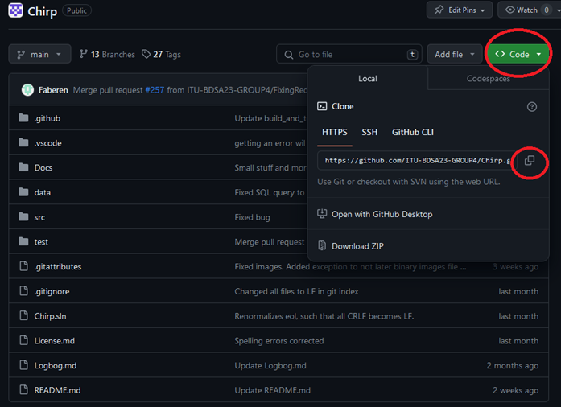
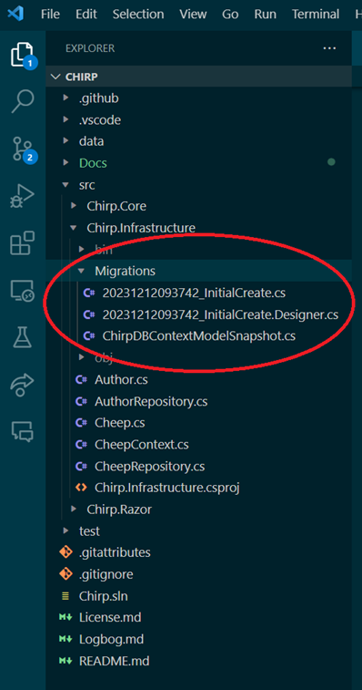

# How to make Chirp! work locally
prerequisites:
1. [download .NET](https://dotnet.microsoft.com/en-us/download)
2. IDE of your choice


## 1. Clone the repository
Follow this link: [github.com/ITU-BDSA23-GROUP4](https://github.com/ITU-BDSA23-GROUP4/Chirp.git)
<br>


copy the url and run the following command in your terminal where you want to clone the repository to.
```bash
git clone https://github.com/ITU-BDSA23-GROUP4/Chirp.git
```

## 2. Running and installing migrations
naviate to the root folder of the program, run the following command in your terminal.
```bash
--global dotnet-ef
```
naviagte to *Chirp/src/Chirp.Infrastructure*
<br> delete all migrations file if they exists
<br>


<br>

then run the following command

```bash
dotnet ef migrations add InitialCreate
dotnet ef database update
```
## 3. Setting up docker
To setup the Docker container for development on own pc you need to run the following command:
```docker run -e "ACCEPT_EULA=Y" -e "MSSQL_SA_PASSWORD=Admin123" -p 1433:1433 --name chirpdb --hostname chirpdb -d mcr.microsoft.com/mssql/server:2022-latest```
<br />
After this the Container should have been created and a new Image can be seen in your Docker Desktop app. With the new lines of code in Program.cs it should create the database on the container. We can all just use the same command since the connectionstring is already made for this password. hostname and port.
### Setup Database on docker
The last step is to create the database on the docker server to do this you are to navigate to the ```Exec``` on your new server. <br/>
To get there go to "Containers" and click on your container.<br/>
1. Go to the "Containers"
2. Open your Container ours is "chirpdb"
<br/>
3. Open ```Exec```.
<br/>
Her you can run bash commands on your container and look around the container.<br/>
We are here to use the MsSQL tool to make a database on this container. To do this we run this ```/opt/mssql-tools/bin/sqlcmd -S localhost -U SA -P Admin123``` (the ```-U``` is the user in our case we will just use SA which is System Admin and ```-P``` is the password for SA) this will gain access to the MsSQL tool. Here we can run SQL commands. Bare in mind that this is a diffrent tool the usual and have different commands.<br/>
The last part is to add the docker connectionstring to the user secrets. Navigate to src/Chirp.Razor and run command ```dotnet user-secrets set "ConnectionStrings:ChirpDB" "Server=localhost,1433;Database=ChirpDB;User=SA;Password=Admin123;TrustServerCertificate=True;MultipleActiveResultSets=True;"```<br/>
You can also give your docker container another name if you want to.


## 4. Running the program
navigate to *src\Chirp.Razor* and run the following command
```bash
dotnet run
```
