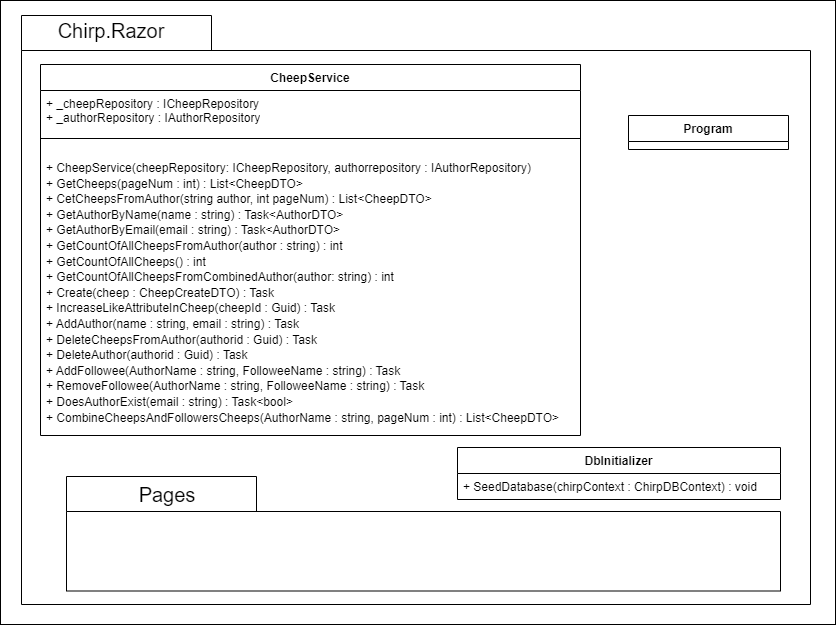
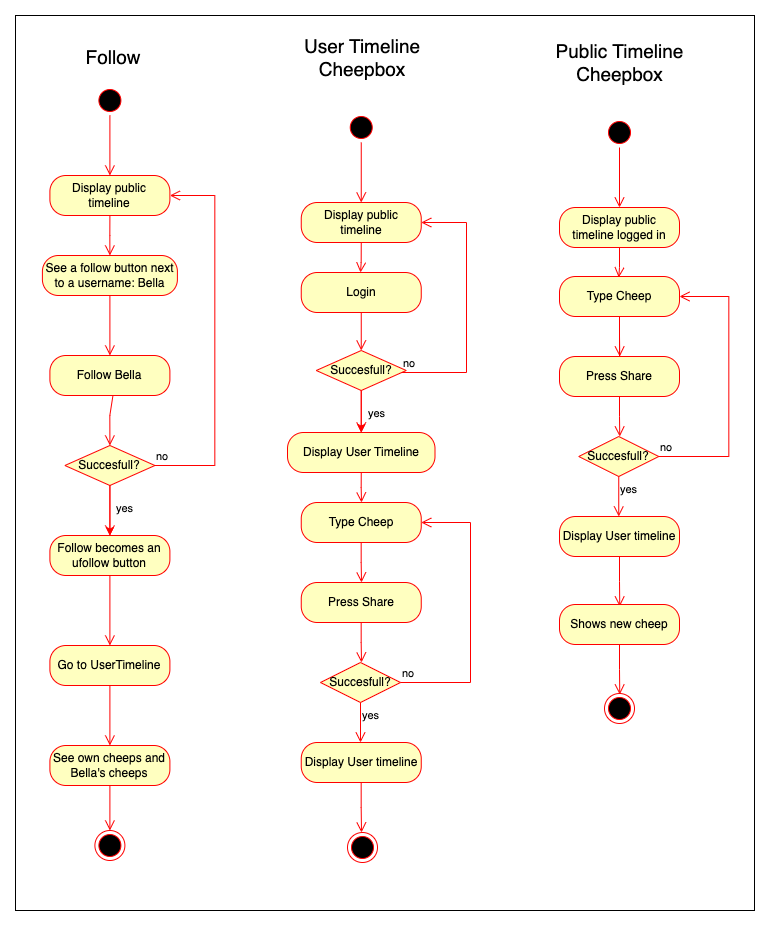
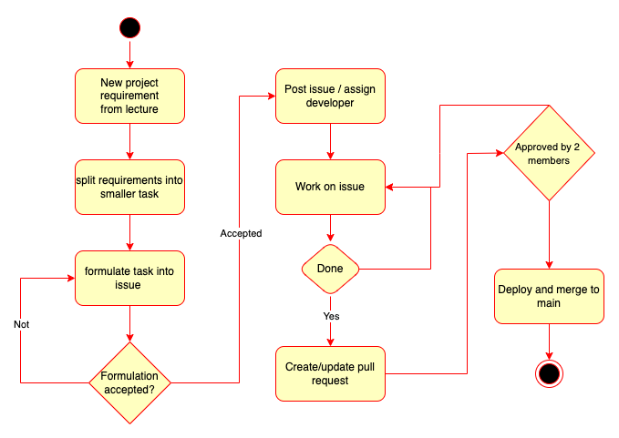

# Design and Architecture of _Chirp!_

## Domain Model
Provide an illustration of your domain model. Make sure that it is correct and complete. In case you are using ASP.NET Identity, make sure to illustrate that accordingly.
<!--  -->

## Architecture — In the small
In the Onion Architecture diagram seen at [@fig:OnionArchitecture] you'll see our applications. In the centre we have our core package.
This is the lowest layer of the application, contains no dependencies and is not likely to change. As we move outwards through the layers, the layers get more specific and dependent on the earlier layers and are more likely to change. 
At the outermost layer, we end with our SQL-Server and razor pages, which interact with our Azure application as external elements. 
<br>

{width=60% #fig:OnionArchitecture}

In order not to overwhelm the diagram. The details of the classes are kept minimal in the Onion class diagram seen on [@fig:OnionClassDiagram]. There is a UML class diagram for each package. All of these are shown in the Onion class diagram. This is done to keep the diagrams clear and readable. The interaction between layers and packages is shown in the Onion class diagram. The internal interaction is shown in the UML class Diagrams [@fig:CoreUML; @fig:InfrastructureUML; @fig:RazorUML; @fig:PagesUML]. 

You will see in our repositories, that we're deleting the author at some point, this was a project requirement. We had two possibilities; delete the user in the sense that they will no longer be traceable, that is make all their cheeps anonymous and delete their information, or we had the possibility of deleting everything that the user ever created. 
We chose to be sure that the user wouldn't come back complaining that their username/normal name still was in a cheep, so we deleted everything that they created.  We chose to give the user full control and ownership over their content, so we deleted everything that they had created. 
This was also the easier approach since we could delete everything that contained that user's id or name, instead of altering everything.
The implementation chosen also allowed us to let some of the data in the database, be deleted through cascading, instead of having to write logic for it.

The method IncreaseLikeAttribute in the CheepRepository, which can be seen in the diagram [@fig:InfrastructureUML], reveals that like is an attribute on the Cheep entity since its only parameters are a Cheep id and not an author id. This is the simplest implementation of the feature, we could come up with. We have chosen to use this implementation due to the overall time constraint of the project. It has the impact, that it is not possible to see or retrieve data from the database, about who has liked a cheep. It is possible for each author to like multiple times. It is not possible to regret a like in the current state of the application, although a dislike method could be implemented.
<br>

{width=60% #fig:CoreUML}

{width=75% #fig:InfrastructureUML}

{width=60% #fig:RazorUML}

{width=60% #fig:PagesUML}

The Onion Architecture (otherwise known as Clean Architecture), is great for having low coupling and high cohesion. When looking at the UML in the more specified onion diagram bellow, there is no unnecessary communication between scripts. 
Having low coupling increase the readability and maintainability of the program. Since there are less dependencies to take into account, even though some of the repositories contain a fair amount of methods.
When moving outward you'll see the packages only use entities further in or in the same layer.

It is worth mentioning that the only way of interacting with the repositories is through their interfaces, which is an important factor in making sure the application has low coupling. The same goes for the CheepService, since every class that needs to access it uses information from the interface, and that interface uses from the other interfaces. 


{width=75% #fig:OnionClassDiagram}

## Architecture of deployed application
In [@fig:Deployment] a deployment diagram can be seen of our Chirp application.


{width=75% #fig:Deployment}


Chirp is a client-server application hosted on the Azure app service as a Web App. The web app is connected to an Azure SQL server where the database can be found. Furthermore the application makes use of an Azure AD B2C tenant for user-authentication. Each node and its means of communication are represented in the diagram. 
 


## User activities
For each user activity bellow, there's a headline describing their scenario. There's one activity diagram which shows the application for a non-authorized user. Since most of our features requires the user to be logged in we had no need to show more. This diagram shows what the user can see as their only available page, the public page, with no additional features like a cheepbox or the possibility of following/unfollowing. They can show a specific page of the author for a cheep if they press their name. 

If a user is logged in, there's a few possible user activities as shown bellow. These diagrams show what the user can experience when following or unfollowing, how the user can see who they're following and vice versa, how they write and share a new cheep, how to delete their information and what happens upon login and logout.
If a new user wants register they will need to login with github. Since this will redirect from our own razor pages, this hasn't been included in the activity diagrams.




The userpage will show more detailed information than who's following you, the user can find their claims (such as their email and username), they'll be able to read about how we're using their information, it's also the location of the Forget Me feature (which deletes their profile and information).
Most of these diagrams are not very detailed, to see more detail of the application you can run it with the help of our guide (How to make _Chirp!_ work locally). There you will see the interface as well as our applications behavior. 

## Sequence diagram
In [@fig:SQD1]. A sequence diagram of an unauthorized actor. Hereafter, referred to as UA, accessing our project. It shows the UA sending the HTTP Get request to receive the website. After the initial request, the Chirp.Razor starts to build the HTML. Here, an asynchronous object creation message is sent through the interface in the core and onto the repository.The repository returns the same static content for all actors sending this request. Using Linq, the repository queries the SQL database for the 32 most recent cheeps. 

The database sends the 32 cheeps to the repository. Which inserts each cheep into a CheepDTO before returning a list of 32 CheepDTOs. This list is sent back through the system, shown in [@fig:SQD1]. Arriving in Chirp.Razor. It is weaved into the HTML, checking the if the user is Authorized. Before the page is returned to the UA. 

{width=70% #fig:SQD1}

[@fig:SQD2] show a known actor accessing our site, logging in and sending a Cheep. The first Get request is the same as seen in [@fig:SQD1]. It deviates during the authentication step as the actor presses the login link. As the actor logs log in, Microsoft Identity redirects them to Azure OIDC. Which then redirect to GitHub. 

After the actor has logged in, GitHub sends a token back to be checked by Azure. The token is in the URL. With it confirmed, the Razor page HTML Will change. 

Then the authorized user fills out the desired cheep and Chirps it. When that happens, Chirp.Razor constructs a CheepDTO and sends it through the core, where it is validated and sent to the repository. Afterwards it is committed to the database granted tha validation confirms. 

Then, confirmation of success is sent back, at which point the razorpage redirects to itself to reload the content. 

{width=70% #fig:SQD2}

# Process
## Build, test, release, and deployment

<!-- Illustrate with a UML activity diagram how your Chirp! applications are build, tested, released, and deployed. That is, illustrate the flow of activities in your respective GitHub Actions workflows. -->

<!-- Describe briefly the illustration, i.e., how you application is built, tested, released, and deployed. -->
### GitHub workflows

To ensure the flow of the project, we use a tool developed by GitHub known as. GitHub Action, otherwise known as a workflow. This will also include when the workflows are activated and used.

#### Build and Test

The build and test workflow can be found on [@fig:Buildtest]. The activity diagram shows how GitHub ensures what is merged into main does not damage it. 


This workflow is run on a pull request every time a commit is made to the branch belonging to the pull request. 
This ensures that main will stay functional by building and testing the project with dotnet and our test suite. If anything fails, it will stop and prevent 
the branch from merging into main.

{width=60% #fig:Buildtest}

#### Publish and release

This workflow is made to automate the creation of a GitHub release when a tag is added, see [@fig:PublishRelease]. It will create a release of the tag. But first, the workflow in succession builds a version for Windows, MacOS and Linux. After that, it will zip the files and add them to the release if a release was made.


{width=75% #fig:PublishRelease}

#### Build and deploy
This workflow can be seen on [@fig:BuildDeploy]. The workflow is made so it will build the program and run the "publish" command to build a version for Linux to be run on the Azure web app. After the publish command, it uploads the artefacts so the next job can use the files of the artefacts. The deploy job will download the artefacts and use their files to deploy to our Azure web app.


{width=60% #fig:BuildDeploy}

<!-- Before putting anything into the workflow actions, we create test manually to run on the computer with the "dotnet test" command. There has been created an activity diagram showing this. For most test we try to implement it going how we expect the method or feature to behave, and after we've concluded that it works, we create a test to challenge this method. By example we can look at the Create(CreateCheepDTO)'s tests in the unit tests. <br> -->
<!-- This can be found in the infrastructure tests in the tests for Cheep Repository.  -->
<!-- We start by testing that what we want it to will work, and then we challenge it, by giving it some input that should throw validation exceptions. When we know both of these will pass, we can then move onto the workflows.  -->


Before committing anything and thus starting the suitable workflow, we test locally with the `dotnet test` command. There is an activity diagram showing this. Tests are implemented with the logic of expected functionality in mind. Testing that the method in question works as expected. It should react as expected, both with harmless and malicious inputs.

For example, the tests for the method Create(CreateCheepDTO) can be examined. They can be found in the infrastructure tests for the tests for Cheap Repository. First, we test that it works as intended with the intended input. After this, we challenge it in the test by giving it the wrong input and testing if validation exceptions are thrown.  

# Teamwork
This section will describe what features and implementation weren't completed and how the group worked with creation of issues and development. <br>

## Project Board

{width=75%}


This figure shows the Project board of Chirp on the day of the hand-in. We have four issues that haven't been implemented before the deadline. All four issues are under the Todo section. None of them are in the project requirements. That is to say, they were formulated under the *Wildstyle* development section. They were, adding tags to cheeps, being able to cheep a meme, trending cheeps and a re-cheep feature. As can be seen from the project board the re-cheep feature had an assigned developer but wasn't completed in time as other requirements had to be met. One *Wildstyle* feature was implemented a like button on the Cheeps. Although the like implementation is missing some functionality. A user can't see which cheep they've liked and they can like, a Cheep infinitely many times.


Three issues regarding the old retired Chirp CLI application is closed, but not implemented. The issues can be seen in the far right column, and is:
- Adding automatic deployment from GitHub to the host service containing the web api.
- Changing the application to use the database on the web service instead of the local hosted database
- Ensuring that the test coverage are adequate after refactoring our wep api

## Issue creation

{width=60% #fig:issues}

This activity diagram shows the flow of our work process. At first, the new requirements are read and understood, and then the group gathers and tries to formulate the tasks into small issues which ideally can be completed within a day's worth of work. If a formulation gets accepted by the group it gets posted on the issue board on Github. A developer assigns themselves to an issue to let others Aknow what they are working on. When the developer feels like they've implemented the feature adequately, that is the acceptance criteria are met, they commit and create a pull request. When a pull request is posted a minimum of two reviewers from the group are needed to further merge it to main and deploy. When reviewing the code a reviewer can request changes and then further work on the issue is required. This process repeats until two reviewers accept the changes and then the code can be merged into main. 

Whenever a sizable pull request was made. We had an internal understanding that even after the minimum requirements of two approved reviews. We would wait a day. This was done to include everyone and provide them with an opportunity to request changes to ensure readability and collaboration with the rest of the application.

Another more simple *"issue-creation-flow"* was also used. If a developer found a bug within the application or other small adjustments were made. An issue was created. This created good documentation for the other developers so all group members could understand why a pull request was made.

# How to make Chirp! work locally
Prerequisites:

1. [download .NET](https://dotnet.microsoft.com/en-us/download)

2. IDE of your choice


## Clone the repository - Step 1
Follow this link: [github.com/ITU-BDSA23-GROUP4](https://github.com/ITU-BDSA23-GROUP4/Chirp.git)

{width=60% #fig:Cloning}

Copy the url and run the following command in your terminal where you want to clone the repository to.
<br>

```bash
git clone https://github.com/ITU-BDSA23-GROUP4/Chirp.git
```

## Running and installing migrations - Step 2
Navigate to the root folder of the program, run the following command in your terminal.
```bash
--global dotnet-ef
```
navigate to *Chirp/src/Chirp.Infrastructure*
<br> 
Delete all migrations file if they exists.
<br>

{width=60% #fig:Migrations}

Then run the following command

```bash
dotnet ef migrations add InitialCreate
dotnet ef database update
```
## Setting up docker - Step 3 {#sec:dockerguide} 
To setup the Docker container for development on your own pc you need to run the following command:
```docker run -e "ACCEPT_EULA=Y" -e "MSSQL_SA_PASSWORD=Admin123" -p 1433:1433 --name chirpdb --hostname chirpdb -d mcr.microsoft.com/mssql/server:2022-latest```
<br />
After this the Container should have been created and a new Image can be seen in your Docker Desktop app. With the new lines of code in Program.cs it should create the database on the container. We can all just use the same command since the connectionstring is already made for this password. hostname and port.

### Setup Database on docker 
The last step is to create the database on the docker server. To do this you are to navigate to the ```Exec``` on your new server. <br/>
To get there go to "Containers" and click on your container.<br/>

1. Go to the "Containers"
2. Open your Container ours is "chirpdb"


{width=75% #fig:DockerContain}

3. Open ```Exec```

{width=75% #fig:DockerExec}

Here you can run bash commands on your container and look around the container.<br/>
We are here to use the MsSQL tool to make a database on this container. To do this we run this ```/opt/mssql-tools/bin/sqlcmd -S localhost -U SA -P Admin123``` (the ```-U``` is the user in our case we will just use SA which is System Admin and ```-P``` is the password for SA) this will gain access to the MsSQL tool. Here we can run SQL commands. Bare in mind that this is a different tool the usual and have different commands.<br/>
The last part is to add the docker connectionstring to the user secrets. Navigate to src/Chirp.Razor and run this command. **Attention:** the line below is one continuous line and should be written like that, although the space between the ChirpDB" and "Server=localhost has to be there.

```bash
dotnet user-secrets set "ConnectionStrings:ChirpDB" 
"Server=localhost,1433;Database=ChirpDB;User=SA;
Password=Admin123;TrustServerCertificate=True;
MultipleActiveResultSets=True;"
```


You can also give your docker container another name if you want to.


## Running the program - Step 4
Navigate to *src\\Chirp.Razor* and run the following command
```bash
dotnet run
```
The program should now be able to run correctly.

# How to run test locally
The test suite of Chirp consists of 3 test folders each targeting their own part of the application, Infrastructure, Razor and playwright tests. All the tests are found in *Chirp/test/*

## Infrastructure.Tests
No prerequisites are needed to accomplish the infrastructure test, simply cd into the *Chirp/test/Chirp.Infrastructure.Tests* folder in your terminal and
run 
  ```bash
  dotnet test
  ```
Our Infrastructure tests targets our database and repositories, it creates an in memory database which all the test are run against.
```bash
var builder = new DbContextOptionsBuilder<ChirpDBContext>();
builder.UseSqlite("Filename=:memory:");
ChirpDBContext context = new(builder.Options);
_connection = context.Database.GetDbConnection() as SqliteConnection;
if (_connection != null)  //Takes care of the null exception
{
    _connection.Open();
}
context.Database.EnsureCreated();
```
### What is tested
- AuthorRepositoryUnitTests
<br> This class targets our AuthorRepository. It performs unit tests for almost every method created in the repository with both correct and incorrect input. e.g. finding author by email or adding a follower.

- CheepRepositoryCreateUnitTests
<br> This class targets our CheepRepository. It specifically targets the methods around the creation of Cheeps. e.g. Adding a Cheep and checking if a Cheep is not empty

- CheepRepositoryUnitTests
<br> This class targets our CheepRepository. It performs unit tests on liking a cheep. e.g. liking increases a Cheeps total likes.

- InMemoryDatabaseTests
<br> This class tests if the in memory database is created correctly which is crucial for the other classes since they all rely on it.

- RestrictedCheepsUnitTests
<br> This class targets the Cheepvalidator. It performs unit tests to check if a Cheep has the correct information, such as not being empty or over 160 characters and having a valid author.


## Razor.Tests
To run the tests you need to setup and download docker. A complete guide for downloading and setting up docker correctly with our application can be found here: [@sec:dockerguide]

After following the guide cd into the Chirp.Razor.tests folder and run the following command
```bash
dotnet test
```
### what is tested
The razor tests consist of one class, **IntegrationTest.cs**. The class creates a local instance of our web application using the [WebApplicationFactory class](https://learn.microsoft.com/en-us/dotnet/api/microsoft.aspnetcore.mvc.testing.webapplicationfactory-1?view=aspnetcore-8.0). With this we can test that our applications ui functions as we expect before we deploy it to azure. The test include, testing 32 Cheeps per page, ordering of Cheeps by date and the functionality of dynamic buttons.

## Playwright.tests
To run the test first download playwright with the following command

  ```bash
  pwsh bin/Debug/net7.0/playwright.ps1 install
  ```
This install various browsers and tools to run UI tests. The browser we use is chromium based.
<br>
if you run in to issues with the version of .net replace net7.0 in the command with the correct version
<br>
if you don't have powerShell installed follow these instructions
[Install PowerShell](https://learn.microsoft.com/en-us/powershell/scripting/install/installing-powershell?view=powershell-7.4)

After completing these steps you can run the test with: 
```bash 
dotnet test 
  ```
When you run the test a chromium based browser will open and the first step tries to log in. Here the automation stops and the user has to log in through Github themselves. **No passwords are saved!** After this step is completed playwright will do the rest itself.

### what is tested
The playwright test differs from the razor test in that it, mimics user behavior on our live website compared to the razor test which test locally. The test navigates through different pages and interacts with the website's functionality confirming that what it interacts with is as expected in the test. 


# Ethics
## License
We chose the *[MIT license](https://licenses.nuget.org/MIT)* for our application, with the major reason being it's open-source nature towards programming-collaboration. Furthermore all the dependencies which we use in our application are also under the MIT license except one, which encourages the collaborative nature of the programming community. A list of all our dependencies and their licenses can be found in the license.md file in the Chirp application. One of our packages is under the *[Apache-license](https://licenses.nuget.org/Apache-2.0)*, which is fine since both are permissive licenses meaning they are able to be used together. This is also stated in our license file. 

## LLMs, ChatGPT, CoPilot, and others
In this section we will go over the AI help that has been through out the process of creating the project.

### ChatGPT

ChatGPT is one of the AI's that we have used through out the project for smaller questions. Theses questions range from C# related code, refactoring of code, setup of docker or .NET console commands. With the help from the AI we can ask questions and get quick response that can help us in the right direction. There are somethings to consider when using ChatGPT the main thing will be the validity of the response since we can't guarantee that it's right.

### Github CoPilot

Github CoPilot has been used through out the project to help with speeding up the process of writing code. This range from repetitive code to unit tests. This is where CoPilot shines with helping auto completion. However, the recommendation that you get from CoPilot may not work since the AI can't know the full extend of the program.

<!-- ChatGBT and/or CoPilot
ChatGBT was used for small questions, or just the simple things as refactoring through the code
 
CoPilot made it a lot easier to make the unit tests after the first few where created, it made this particular task go faster.
It was helpful in autocompleting a few lines, and sometimes to help debug using the coPilot chat. -->