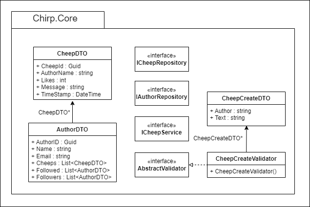

# Design and Architecture of _Chirp!_

## Domain Model
Provide an illustration of your domain model. Make sure that it is correct and complete. In case you are using ASP.NET Identity, make sure to illustrate that accordingly.
<!--  -->

## Architecture — In the small
In the Onion Architecture diagram bellow you'll see our applications. In the centre we have our core package. This is the lowest layer of the application, contains no dependencies and is not likely to change. As we move outwards through the layers the layeris get more specific, is dependent on the earlier layers and is more likely to change. 
At the most outer layer we end with our SQL-Server and razor pages, which interacts with our Azure application as external elements. 
<br>

<figure align = "center">
    
    <figcaption style="font-size:11px" ><b>Fig. XX - Onion Architecture Diagram</b></figcaption>
</figure>


These layers can be seen more detailed in our class diagram. There is one for each package, and they show everything needed to know about our classes. We've chosen to show every package independent for more simplicity in reading the diagrams. The diagrams show each package and how the classes interact with each other. To see how they interact with the other layers, see [OnionClassDiagram](#OnionClassDiagram) further down.

You will see in our repositories, that we're deleting the author at some point, this was a project requirement. We had two possibilities; delete the user in the sense that they will no longer be traceable, that is make everything anonymous and delete their information, or we had the possibility of just deleting everything that the user ever created. We chose to give the user full control and ownership over their content, so we deleted everything that they had created. 
This was also the easier approach since we could delete everything that contained that user's id or name, instead of altering everything.
The implementation chosen, also allowed us to letting som of the data in the database, be deleted through cascading, instead of having to write logic for it.

The method IncreaseLikeAttribute in the CheepRepository, which can be seen in the diagram [ULM Class Infrastructure](#ULMClassInfrastructure), reveals that likes is an attribute on the Cheep entity, since its only parameters are a cheep id, and not an author id. This is the simplest implementation of the feature, we could come up with. We have chosen to use this implementation due to the overall time constraint of the project. It has the impact, that it is not possible to see or retrieve data from the database, about who has liked a cheep. It is possible for each author to look multiple times. It is not possible to regret a like in the current state of the application, although a dislike method could be implemented.
<br>

<figure align = "center">
    
    <figcaption style="  font-size:11px"><b>Fig. XX - ULM Class Diagram</b></figcaption>
</figure>

<figure align = "center">
    
    <figcaption style="  font-size:11px"><b>Fig. XX - ULM Package Diagram of the Chirp.Infrastructure</b></figcaption>
</figure>

<figure align = "center">
    
    <figcaption style="  font-size:11px"><b>Fig. XX - ULM Package Diagram of the Chirp.Razor </b></figcaption>
</figure>

<figure align = "center">
    
    <figcaption style="  font-size:11px"><b>Fig. XX - ULM Package Diagram of the Chirp.Razor/Pages </b></figcaption>
</figure>

The Onion Architecture (otherwise known as Clean Architecture), is great for having low coupling and high cohesion. When looking at the UML in the more specified onion diagram bellow, there is no unnecessary communication between scripts. Having low coupling making the readability and maintainability of the program better, since there are less dependencies to take into account, even though some of the repositories contain a fair amount of methods. When moving outward you'll see the packages only use entities further in or in the same layer.

It is worth mentioning that the only way of interacting with the repositories is through their interfaces, which is an important factor in making sure the application has low coupling. The same goes for the CheepService, since every class that needs to access it uses information from the interface, and that interface uses from the other interfaces. 
<br>
<figure id="OnionClassDiagram">
    <center>
  <figcaption >Fig.XX OnionClassDiagram</figcaption></center>
</figure>

## Architecture of deployed application
In the following figure a deployment diagram can be seen of our Chirp application.

<figure>
    <center>
  <figcaption>Fig.XX Deployment diagram</figcaption></center>
</figure>


Chirp is a client-server application hosted on the Azure app service as a Web App. The web app is connected to a Azure SQL server where the database can be found. Furthermore the application makes use of a Azure AD B2C tenant for user-authentication. The different nodes means of communication is represented in the diagram.


## User activities
Illustrate typical scenarios of a user journey through your Chirp! application. That is, start illustrating the first page that is presented to a non-authorized user, illustrate what a non-authorized user can do with your Chirp! application, and finally illustrate what a user can do after authentication. 

Make sure that the illustrations are in line with the actual behavior of your application.

<!-- Figugres are refered to as SQDX as in Sequence Diagram X -->
## Sequence diagram
Figure SQD1 shows a sequence diagram of an unauthorized actor, from now on referred to as UA, accessing our project. It shows the UA sending the HTTP Get request to receive the webpage. After the initial request, the Chirp.Razor starts to build the HTML. Here, an asynchronous object creation message is sent through the interface in the core and onto the repository. The repository returns the same static content for all actors sending this request. Using Linq, the repository queries the SQL database for the 32 most recent cheeps. 

The database sends the 32 cheeps to the repository. Which inserts each cheep into a CheepDTO before returning a list of 32 CheepDTOs. This list is sent back through the system, shown in Fig SQD1. Arriving in Chirp.Razor. It is put into the HTML, and also checking if the user is Authorized. Before the page is returned to the UA. 

<figure align = "center">
    
    <figcaption style="  font-size:11px"><b>Fig. SQD1 - Sequence diagram for an unauthorized user </b></figcaption>
</figure>

Figure SQD2. Shows a known actor accessing our site, logging in and sending a Cheep. The first Get request is the same as seen in Fig SQD1. It deviates during the authentication step as the actor presses the login link. As the actor logs in, Microsoft Identity redirects them to Azure OIDC. Which then redirects to GitHub. 

After the actor has logged in, GitHub sends a token back to be checked by Azure. The token is in the URL. With it confirmed, the Razor page HTML Will change. 

Then the authorized user fills out the desired cheep and Chirps it. When that happens, Chirp.Razor constructs a CheepDTO and sends it through the core, where it is validated and sent to the repository. Afterwards it is committed to the database granted that the validation confirms. 

Then, confirmation of success is sent back, at which point the razorpage redirects to itself to reload the content. 
<figure align = "center">
    
    <figcaption style="  font-size:11px"><b>Fig. SQD2 - Sequence diagram for an unauthorized user </b></figcaption>
</figure>


# Process
## Build, test, release, and deployment

<!-- Illustrate with a UML activity diagram how your Chirp! applications are build, tested, released, and deployed. That is, illustrate the flow of activities in your respective GitHub Actions workflows. -->

<!-- Describe briefly the illustration, i.e., how you application is built, tested, released, and deployed. -->
### GitHub workflows

To ensure the flow of the project, we use a tool developed by GitHub known as. GitHub Action, otherwise known as workflow. 
<!-- I do not understand this sentence, what is entailed exactly? - Lukas -->
This will also entail when the workflows are activated and used.

#### Build and Test

The build and test workflow can be found in <!-- in what? -->. The activity diagram shows how GitHub ensures what is merged into main. This workflow is run on a pull request every time a commit is made to the branch in the pull request. This is to ensure that main will still work by building the project with dotnet and tests made for the project.
 Because it runs the tests as well, it ensures that any incoming changes do not affect the functionality. If anything fails, it will stop and prevent the branch from merging into main.
<figure>
   <center> 
    <figcaption>Fig.XX Build and test activity diagram</figcaption></center>
</figure>

#### Publish and release

This workflow is made to automate the creation of a GitHub release when a tag is added (Appendix?). It will create a release of the tag. But first, the workflow builds a version for Windows, MacOS and Linux. After that, it will zip the files and add them to the release if a release was made.
<figure>
   <center> 
    <figcaption>Fig.XX Publish new release activity diagram</figcaption></center>
</figure>

#### Build and deploy
This workflow can be seen here (Appendix?). The workflow is made so it will build the program and run the "publish" command to build a version for Linux to be run on the Azure web app. After the publish command, it uploads the artifacts so the next job can use the files. The deploy job will download the artefact and use the files to deploy to our Azure web app.
<figure>
   <center> 
    <figcaption>Fig.XX Build and deploy activity diagram</figcaption></center>
</figure>

<!-- Before putting anything into the workflow actions, we create test manually to run on the computer with the "dotnet test" command. There has been created an activity diagram showing this. For most test we try to implement it going how we expect the method or feature to behave, and after we've concluded that it works, we create a test to challenge this method. By example we can look at the Create(CreateCheepDTO)'s tests in the unit tests. <br> -->
<!-- This can be found in the infrastructure tests in the tests for Cheep Repository.  -->
<!-- We start by testing that what we want it to will work, and then we challenge it, by giving it some input that should throw validation exceptions. When we know both of these will pass, we can then move onto the workflows.  -->

<br>
...............................................
<br>
Before putting anything into the workflow actions, we create test manually to run on the computer with the "dotnet test" command. There has been created an activity diagram showing this. For most test we try to implement it going how we expect the method or feature to behave, and after we've concluded that it works, we create a test to challenge this method. By example we can look at the Create(CreateCheepDTO)'s tests in the unit tests. <br>
This can be found in the infrastructure tests in the tests for Cheep Repository. 
We start by testing that what we want it to will work, and then we challenge it, by giving it some input that should throw validation exceptions. When we know both of these will pass, we can then move onto the workflows. 

# Teamwork
This section will describe what features and implementation weren't completed and how the group worked with creation of issues and development. <br>

## Project Board
{width=60%}
<br>
This figure shows the Project board of Chirp on the day of the hand-in. We have four issues that haven't been implemented before the deadline. All four issues are under the Todo section. None of them are in the project requirements. That is to say, they were formulated under the *Wildstyle* development section. They were, adding tags to cheeps, being able to cheep a meme, trending cheeps and a re-cheep feature. As can be seen from the project board the re-cheep feature had an assigned developer but wasn't completed in time as other requirements had to be met. One *Wildstyle* feature was implemented a like button on the Cheeps. The like implementation is although quite simple. A user can't see which cheep they've liked and they can like, a Cheep infinitely many times.

Three issues regarding the old retired Chirp CLI application is closed, but not implemented. The issues can be seen in the far right column, and is:
- Adding automatic deployment from GitHub to the host service containing the web api.
- Changing the application to use the database on the web service instead of the local hosted database
- Ensuring that the test coverage are adequate after refactoring our wep api

## Issue creation
{width=60%}
<br>
This activity diagram shows the flow of our work process. At first, the new requirements are read and understood, and then the group gathers and tries to formulate the tasks into small issues which ideally can be completed within a day's worth of work. If a formulation gets accepted by the group it gets posted on the issue board on Github. A developer assigns themselves to an issue to let others know what they are working on. When the developer feels like they've implemented the feature adequately, that is the acceptance criterias are met, they commit and create a pull request. When a pull request is posted a minimum og two reviewers from the group are needed to accept thee pull request, before merging it into main and deploy to Azure. When reviewing the code a reviewer can request changes and then further work on the issue is required. This process repeats until the same reviewer accepts the changes and then the code can be merged into main. 

The group had a gentleman agreement, if not all members of the group has reviewed a pull request, one must wait a 24 hours before merging into main, even if two reviewers has accepted the pull request. This is to allow every member of the group to have a chance of reviewing the pull request, but still not bringing development to a stall. This offered a balance between keeping everyone "in the loop" and being able to implement changes fairly quickly, that we found to be working fairly well.

Another more simple *"issue-creation-flow"* was also used. If a developer found a bug within the application or other small adjustments were made. An issue was created. This created good documentation for the other developers so all group members could understand why a pull request was made.

# How to make Chirp! work locally
prerequisites:
1. [download .NET](https://dotnet.microsoft.com/en-us/download)
2. IDE of your choice
3. [Install Docker](https://www.docker.com/products/docker-desktop/)


## 1. Clone the repository
Follow this link: [github.com/ITU-BDSA23-GROUP4](https://github.com/ITU-BDSA23-GROUP4/Chirp.git)
<br>

<figure>
    <center>
  <figcaption>Fig.XX Cloning</figcaption></center>
</figure>

copy the url and run the following command in your terminal where you want to clone the repository to.
```bash
git clone https://github.com/ITU-BDSA23-GROUP4/Chirp.git
```

## 2. Running and installing migrations
naviate to the root folder of the program, run the following command in your terminal.
```bash
--global dotnet-ef
```
naviagte to *Chirp/src/Chirp.Infrastructure*
<br> delete all migrations file if they exists
<br>

<figure>
    <center>
  <figcaption>Fig.XX Deletion of migrations</figcaption></center>
</figure>

then run the following command

```bash
dotnet ef migrations add InitialCreate
dotnet ef database update
```
## 3. Setting up docker
To setup the Docker container for development on your own pc you need to run the following command:
```docker run -e "ACCEPT_EULA=Y" -e "MSSQL_SA_PASSWORD=Admin123" -p 1433:1433 --name chirpdb --hostname chirpdb -d mcr.microsoft.com/mssql/server:2022-latest```
<br />
After this the Container should have been created and a new Image can be seen in your Docker Desktop app. With the new lines of code in Program.cs it should create the database on the container. We can all just use the same command since the connectionstring is already made for this password, hostname and port.
### Setup Database on docker
The last step is to create the database on the docker server. To do this you are to navigate to the ```Exec``` on your new server. <br/>
To get there go to "Containers" and click on your container.<br/>

1. Go to the "Containers"
2. Open your Container ours is "chirpdb"

<figure>
    <center>
  <figcaption>Fig.XX Container</figcaption></center>
</figure>

3. Open ```Exec```

<figure>
    <center>
  <figcaption>Fig.XX Exec</figcaption></center>
</figure>

Her you can run bash commands on your container and look around the container.<br/>
We are here to use the MsSQL tool to make a database on this container. To do this we run this ```/opt/mssql-tools/bin/sqlcmd -S localhost -U SA -P Admin123``` (the ```-U``` is the user in our case we will just use SA which is System Admin and ```-P``` is the password for SA) this will gain access to the MsSQL tool. Here we can run SQL commands. Bare in mind that this is a different tool than a usual SQL query tool and have different commands.<br/>
The last part is to add the docker connectionstring to the user secrets. Navigate to src/Chirp.Razor and run command ```dotnet user-secrets set "ConnectionStrings:ChirpDB" "Server=localhost,1433;Database=ChirpDB;User=SA;Password=Admin123;TrustServerCertificate=True;MultipleActiveResultSets=True;"```<br/>
You can also give your docker container another name if you want to.


## 4. Running the program
navigate to *src\Chirp.Razor* and run the following command
```bash
dotnet run
```

# How to run test locally
The test suite of Chirp consists of 3 test folders each targeting their own part of the application, Infrastructure, Razor and playwright tests. All the tests are found in *Chirp/test/*

## Infrastructure.Tests
No prerequisites are needed to accomplish the infrastructure test, simply cd into the *Chirp/test/Chirp.Infrastructure.Tests* folder in your terminal and
run 
  ```bash
  dotnet test
  ```
Our Infrastructure tests targets our database and repositories, it creates an in memory database which all the test are run against.
```bash
var builder = new DbContextOptionsBuilder<ChirpDBContext>();
builder.UseSqlite("Filename=:memory:");
ChirpDBContext context = new(builder.Options);
_connection = context.Database.GetDbConnection() as SqliteConnection;
if (_connection != null)  //Takes care of the null exception
{
    _connection.Open();
}
context.Database.EnsureCreated();
```
### What is tested
- AuthorRepositoryUnitTests
<br> This class targets our AuthorRepository. It performs unit tests for almost every method created in the repository with both correct and incorrect input. e.g. finding author by email or adding a follower.

- CheepRepositoryCreateUnitTests
<br> This class targets our CheepRepository. It specifically targets the methods around the creation of Cheeps. e.g. Adding a Cheep and checking if a Cheep is not empty

- CheepRepositoryUnitTests
<br> This class targets our CheepRepository. It performs unit tests on liking a cheep. e.g. liking increases a Cheeps total likes.

- InMemoryDatabaseTests
<br> This class tests if the in memory database is created correctly which is crucial for the other classes since they all rely on it.

- RestrictedCheepsUnitTests
<br> This class targets the Cheepvalidator. It performs unit tests to check if a Cheep has the correct information, such as not being empty or over 160 characters and having a valid author.


## Razor.Tests
To run the tests you need to setup and download docker. A complete guide for downloading and setting up docker correctly with our application can be found [here](#3-setting-up-docker)
After following the guide cd into the Chirp.Razor.tests folder and run the following command
```bash
dotnet test
```
### What is tested
The razor tests consist of one class, **IntegrationTest.cs**. The class creates a local instance of our web application using the [WebApplicationFactory class](https://learn.microsoft.com/en-us/dotnet/api/microsoft.aspnetcore.mvc.testing.webapplicationfactory-1?view=aspnetcore-8.0). With this we can test that our applications UI functions as we expect, before we deploy it to azure. The test include testing 32 Cheeps per page, ordering of Cheeps by date and the functionality of dynamic buttons.

## Playwright.tests
To run the test first download playwright with the following command

  ```bash
  pwsh bin/Debug/net7.0/playwright.ps1 install
  ```
This install various browsers and tools to run UI tests. The browser we use is chromium based.
<br>
if you run in to issues with the version of .net replace net7.0 in the command with the correct version
<br>
if you don't have powerShell installed follow these instructions
[Install PowerShell](https://learn.microsoft.com/en-us/powershell/scripting/install/installing-powershell?view=powershell-7.4)

After completing these steps you can run the test with: 
```bash 
dotnet test 
  ```
When you run the test a chromium based browser will open and the first step tries to log in. Here the automation stops and the user has to log in through Github themselves. **No passwords are saved!** After this step is completed playwright will do the rest itself.

### What is tested
The playwright test differs from the razor test in that it, mimics user behavior on our live website compared to the razor test which test locally. The test navigates through different pages and interacts with the website's functionality confirming that what it interacts with is as expected in the test. 


# Ethics
## License
We chose the [MIT license](https://licenses.nuget.org/MIT) for our application, with the major reason being it's open-source nature towards programming-collaboration. Furthermore all the dependencies which we use in our application are also under the MIT license except one, which encourages the collaborative nature of the programming community. A list of all our dependencies and their licenses can be found [here](../License.md). One of our packages is under the [Apache-license](https://licenses.nuget.org/Apache-2.0), which is fine since both are permissive licenses meaning they are able to be used together. This is also stated in our license file. 

## LLMs, ChatGPT, CoPilot, and others
In this section we will go over the AI help that has been through out the process of creating the project.

### ChatGPT

ChatGPT is one of the AI's that we have used through out the project for smaller questions. Theses questions range from C# related code, refactoring of code, setup of docker or .NET console commands. With the help from the AI we can ask questions and get quick response that can help us in the right direction. There are somethings to consider when using ChatGPT the main thing will be the validity of the response since we can't guarantee that it's right.

### Github CoPilot

Github CoPilot has been used through out the project to help with speeding up the process of writing code. This range from repetitive code to unit tests. This is where CoPilot shines with helping auto completion. However the recommendation that you get from CoPilot may not work since the AI can't know the full extend of the program.

<!-- ChatGBT and/or CoPilot
ChatGBT was used for small questions, or just the simple things as refactoring through the code
 
CoPilot made it a lot easier to make the unit tests after the first few where created, it made this particular task go faster.
It was helpful in autocompleting a few lines, and sometimes to help debug using the coPilot chat. -->