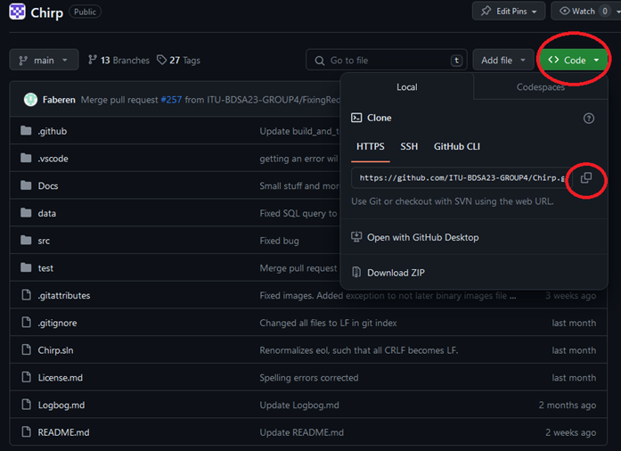

# How to make Chirp! work locally
prerequisites:
1. [download .NET](https://dotnet.microsoft.com/en-us/download)
2. IDE of your choice


## 1. Clone the repository
Follow this link: [github.com/ITU-BDSA23-GROUP4](https://github.com/ITU-BDSA23-GROUP4/Chirp.git)
<br>


copy the url and run the following command in your terminal where you want to clone the repository to.
```bash
git clone https://github.com/ITU-BDSA23-GROUP4/Chirp.git
```

## 2. Running and installing migrations
naviate to the root folder of the program, run the following command in your terminal.
```bash
--global dotnet-ef
```
naviagte to *Chirp/src/Chirp.Infrastructure*
<br> delete all migrations file if they exists
<br>


<br>

then run the following command

```bash
dotnet ef migrations add InitialCreate
dotnet ef database update
```
## 3. Setting up docker
There is a complete guide to docker in our [README.md](..\README.md#docker-setup)


## 4. Running the program
navigate to *src\Chirp.Razor* and run the following command
```bash
dotnet run
```
